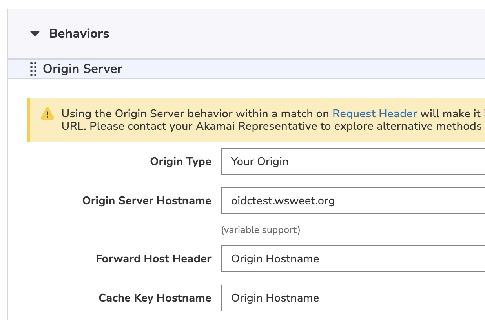

# OAuth2 Client for Akamai EdgeWorkers

[](https://opensource.org/licenses/ISC)
[](https://techdocs.akamai.com/edgeworkers/)
[](https://pnpm.io)

> ⚠️ This project is a **sample implementation** and **not reviewed for production use**. Use at your own risk.

## 🌐 Overview

This EdgeWorker demonstrates how to integrate OAuth2 authentication using [`@badgateway/oauth2-client`](https://github.com/badgateway/oauth2-client). It includes a streamlined CI-friendly build and deployment pipeline using [Akamai CLI](https://techdocs.akamai.com/cli/docs) and `pnpm`.

Configured by default to authenticate against [https://oidctest.wsweet.org/](https://oidctest.wsweet.org/), this sample helps you understand how to securely run OAuth2 flows directly at the edge.

---

## ⚙️ Setup

### Prerequisites

- [pnpm](https://pnpm.io)
- [Akamai CLI](https://techdocs.akamai.com/cli/docs/install)
  - EdgeWorkers module installed: `akamai install edgeworkers`
- `jq` for CLI JSON manipulation

### Install dependencies

```bash
pnpm install
```

### Configure deployment

In `package.json`, update the `config` block:

```json
"config": {
  "account_switch": "--accountkey B-C-1ED34DK:1-8BYUX", // Optional
  "ew_id": "99366" // Your EdgeWorker ID
}
```

If you are not using multi-account setups, you must leave `account_switch` empty.

### Property configuration

While EdgeWorker must be enabled on desired request, a dedicated rule must be added, allowing sub requests to OAuth2 server.

Only for specific requests from your EdgeWorker


Set Origin as OAuth2 Server and forward Origin Hostname


Allow caching of metadata, Origin-piloted


Allow POST request and remove Vary header to allow caching


---

## 🚀 Build & Deploy

### One-step release (build, deploy, and activate)

```bash
pnpm version patch  # or minor, major
```

This will:

* Update version in `package.json`
* Sync it to `bundle.json`
* Build the bundle
* Deploy to Akamai
* Activate it on staging

### Manual steps (if preferred)

#### Build

```bash
pnpm run build
```

This creates the production `dist/bundle.tgz` using Rollup and includes `bundle.json`.

#### Deploy to Akamai

```bash
pnpm run deploy
```

#### Activate on staging

```bash
pnpm run activate-staging
```

#### Activate on production

```bash
pnpm run activate-production
```

---

## 🔧 Development Utilities

| Command                    | Description                                                      |
| -------------------------- | ---------------------------------------------------------------- |
| `pnpm run status`          | Show current status of EdgeWorker deployment                     |
| `pnpm run debugauth`       | Get 12h temporary edgeworker debug token                         |
| `pnpm run version`         | Sync version to `bundle.json` and stage it for Git               |

---

## 📁 Project Structure

```
.
├── dist/               # Built package (after build)
├── src/                # EdgeWorker source code
│   └── main.js
├── bundle.json         # Metadata for EdgeWorkers deployment
├── package.json        # Project config and scripts
└── README.md
```

---

## 📦 Dependencies

### Runtime

* [`@badgateway/oauth2-client`](https://github.com/badgateway/oauth2-client) – OAuth2 client for JS
* [`url-polyfill`](https://www.npmjs.com/package/url-polyfill) – Ensures compatibility for `URL` objects in EdgeWorkers

### Dev

* [`rollup`](https://rollupjs.org/) – Module bundler
* Rollup plugins:
  * `@rollup/plugin-node-resolve`
  * `@rollup/plugin-commonjs`
  * `@rollup/plugin-inject`
  * `@rollup/plugin-dynamic-import-vars`
* [`@types/akamai-edgeworkers`](https://www.npmjs.com/package/@types/akamai-edgeworkers) – TypeScript support
* `jq` – JSON command-line parser

---

## 🤝 Contributing

Contributions are welcome! If you spot a bug or want to enhance the sample, feel free to open a pull request or issue.

---

## 📄 License

Licensed under the [ISC License](LICENSE).

---

> Built with 💙 on Akamai Edge
